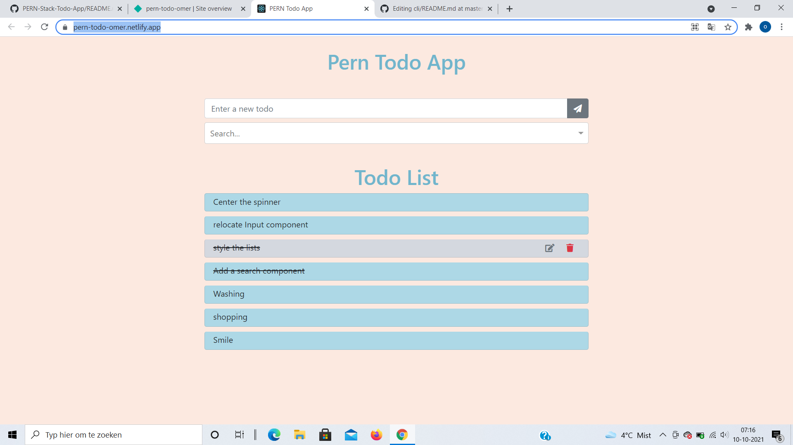
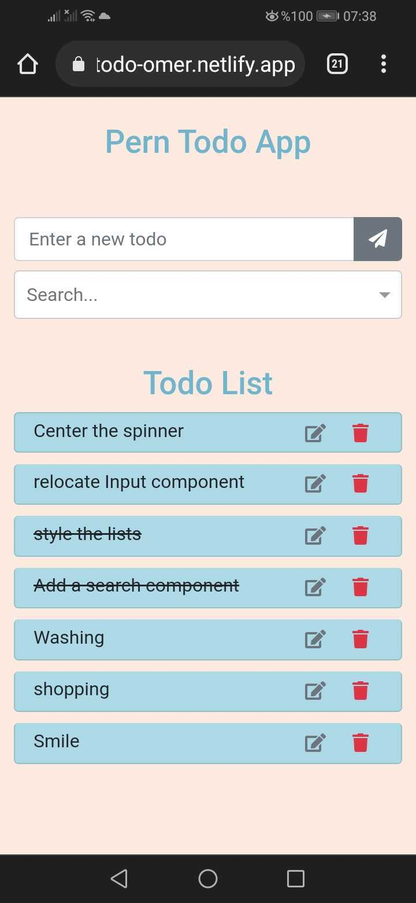

# PERN-Stack-Todo-App

## General Info

A basic todo app which has create, update, and delete features.
URL: https://pern-todo-omer.netlify.app/

## Demo

https://youtu.be/MEdvyU40N0k

## Setup

### Repository cloning and npm packages installations

- Navigate to the desired location in your favourite terminal and type `git clone https://github.com/DegirmenciOmer/PERN-Stack-Todo-App`
- `cd server` and then `npm i` This will install the required packages of the backend.
- When you are done with that, `cd ../client` and then `npm i` to install frontend packages

- create a `.env`file under `client` directory and add `REACT_APP_DEV_URL=http://localhost:5000` this is the URL to get your client app connected to the server.

### Database connection

- Make sure you already installed postgresl in your machine.
- Open `database.sql` in your code editor.
- Open a new terminal
- type `psql` and then follow the instructions.
- type `\l` to see the list of databases in your local
- Copy the first command in `database.sql` file and paste it in your terminal. This will create a new database which you will be using during our project.
- type `\l` again to see that perntodo is initialized as one of the databases in your local
- type `\c perntodo`
- Then successively copy and paste the next two commands in `database.sql` so that we can initialize the two tables we need in our project

### Run the app

- Navigate to `server` directory.
- Type `npm run dev` to run the fullstack application
- 🎉🎉🎉 You have run the app successfully! 🎉🎉🎉

## Add new todo

 <vr/> 

- When you add a new todo, it will be displayed automatically on the top of the list( originated from the DB)

## Search

 <vr/>


- You can search a specific todo with auto-complete feature.

## Update todo


- You can easily edit an existing todo.

## Display as done

- When you click/press on a todo item, it will set as done.

## Delete todo


## Technologies

- Backend: NodeJS, Express
- Database: PostgreSQL
- Frontend: ReactJS
- UI: React Bootstrap

## Clone this repository

```
$ git clone https://github.com/DegirmenciOmer/PERN-Stack-Todo-App.git
```

## To run the dev server:

```
$ cd server/
$ npm run dev

//This will start both server and frontend.
```

## Reference

This project was initially coded along with [this tutorial](https://www.youtube.com/watch?v=ldYcgPKEZC8).
